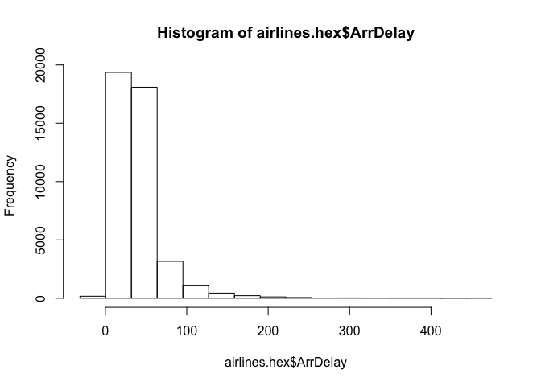

H20: Generalized Linear Models (GLM)
================
@jrcajide
8/4/2017

``` r
# install.packages("h2o")

library(h2o)
```

    ## 
    ## ----------------------------------------------------------------------
    ## 
    ## Your next step is to start H2O:
    ##     > h2o.init()
    ## 
    ## For H2O package documentation, ask for help:
    ##     > ??h2o
    ## 
    ## After starting H2O, you can use the Web UI at http://localhost:54321
    ## For more information visit http://docs.h2o.ai
    ## 
    ## ----------------------------------------------------------------------

    ## 
    ## Attaching package: 'h2o'

    ## The following objects are masked from 'package:stats':
    ## 
    ##     cor, sd, var

    ## The following objects are masked from 'package:base':
    ## 
    ##     &&, %*%, %in%, ||, apply, as.factor, as.numeric, colnames,
    ##     colnames<-, ifelse, is.character, is.factor, is.numeric, log,
    ##     log10, log1p, log2, round, signif, trunc

``` r
h2o.init(nthreads = 4, max_mem_size = "2G")
```

    ##  Connection successful!
    ## 
    ## R is connected to the H2O cluster: 
    ##     H2O cluster uptime:         1 hours 2 minutes 
    ##     H2O cluster version:        3.10.3.6 
    ##     H2O cluster version age:    1 month and 18 days  
    ##     H2O cluster name:           H2O_started_from_R_JOSE_syi657 
    ##     H2O cluster total nodes:    1 
    ##     H2O cluster total memory:   1.76 GB 
    ##     H2O cluster total cores:    8 
    ##     H2O cluster allowed cores:  4 
    ##     H2O cluster healthy:        TRUE 
    ##     H2O Connection ip:          localhost 
    ##     H2O Connection port:        54321 
    ##     H2O Connection proxy:       NA 
    ##     R Version:                  R version 3.3.1 (2016-06-21)

``` r
# http://localhost:54321

h2o.clusterInfo()
```

    ## R is connected to the H2O cluster: 
    ##     H2O cluster uptime:         1 hours 2 minutes 
    ##     H2O cluster version:        3.10.3.6 
    ##     H2O cluster version age:    1 month and 18 days  
    ##     H2O cluster name:           H2O_started_from_R_JOSE_syi657 
    ##     H2O cluster total nodes:    1 
    ##     H2O cluster total memory:   1.76 GB 
    ##     H2O cluster total cores:    8 
    ##     H2O cluster allowed cores:  4 
    ##     H2O cluster healthy:        TRUE 
    ##     H2O Connection ip:          localhost 
    ##     H2O Connection port:        54321 
    ##     H2O Connection proxy:       NA 
    ##     R Version:                  R version 3.3.1 (2016-06-21)

Generalized Linear Models (GLM): Provides flexible generalization of ordinary linear regression for response variables with error distribution models other than a Gaussian (normal) distribution. GLM unifies various other statistical models, including Poisson, linear, logistic, and others when using `1 and`2 regularization.

``` r
# Import dataset and display summary
airlinesURL = "https://s3.amazonaws.com/h2o-airlines-unpacked/allyears2k.csv"
airlines.hex = h2o.importFile(path = airlinesURL, destination_frame = "airlines.hex")
```

    ## 
      |                                                                       
      |                                                                 |   0%
      |                                                                       
      |=================================================================| 100%

``` r
summary(airlines.hex)
```

    ## Warning in summary.H2OFrame(airlines.hex): Approximated quantiles
    ## computed! If you are interested in exact quantiles, please pass the
    ## `exact_quantiles=TRUE` parameter.

    ##  Year           Month            DayofMonth     DayOfWeek      
    ##  Min.   :1987   Min.   : 1.000   Min.   : 1.0   Min.   :1.000  
    ##  1st Qu.:1992   1st Qu.: 1.000   1st Qu.: 6.0   1st Qu.:2.000  
    ##  Median :1998   Median : 1.000   Median :14.0   Median :4.000  
    ##  Mean   :1998   Mean   : 1.409   Mean   :14.6   Mean   :3.821  
    ##  3rd Qu.:2003   3rd Qu.: 1.000   3rd Qu.:23.0   3rd Qu.:5.000  
    ##  Max.   :2008   Max.   :10.000   Max.   :31.0   Max.   :7.000  
    ##                                                                
    ##  DepTime          CRSDepTime       ArrTime        CRSArrTime    
    ##  Min.   :   1.0   Min.   :   0.0   Min.   :   1   Min.   :   0  
    ##  1st Qu.: 927.4   1st Qu.: 908.6   1st Qu.:1117   1st Qu.:1107  
    ##  Median :1328.2   Median :1319.2   Median :1525   Median :1515  
    ##  Mean   :1345.8   Mean   :1313.2   Mean   :1505   Mean   :1485  
    ##  3rd Qu.:1733.8   3rd Qu.:1718.1   3rd Qu.:1916   3rd Qu.:1902  
    ##  Max.   :2400.0   Max.   :2359.0   Max.   :2400   Max.   :2359  
    ##  NA's   :1086                      NA's   :1195                 
    ##  UniqueCarrier FlightNum        TailNum                 ActualElapsedTime
    ##  US:18729      Min.   :   1.0   UNKNOW          :  179  Min.   : 16.0    
    ##  UA: 9434      1st Qu.: 202.4   000000          :  124  1st Qu.: 71.0    
    ##  WN: 6170      Median : 553.9   <0xE4>NKNO<0xE6>:  114  Median :101.0    
    ##  HP: 3451      Mean   : 818.8   0               :   66  Mean   :124.8    
    ##  PS: 3212      3rd Qu.:1241.0   N912UA          :   59  3rd Qu.:151.0    
    ##  DL:  935      Max.   :3949.0   N316AW          :   56  Max.   :475.0    
    ##                                 NA              :16024  NA's   :1195     
    ##  CRSElapsedTime AirTime         ArrDelay          DepDelay        
    ##  Min.   : 17    Min.   : 14.0   Min.   :-63.000   Min.   :-16.00  
    ##  1st Qu.: 71    1st Qu.: 61.0   1st Qu.: -6.000   1st Qu.: -2.00  
    ##  Median :102    Median : 91.0   Median :  2.000   Median :  1.00  
    ##  Mean   :125    Mean   :114.3   Mean   :  9.317   Mean   : 10.01  
    ##  3rd Qu.:151    3rd Qu.:140.0   3rd Qu.: 14.000   3rd Qu.: 10.00  
    ##  Max.   :437    Max.   :402.0   Max.   :475.000   Max.   :473.00  
    ##  NA's   :13     NA's   :16649   NA's   :1195      NA's   :1086    
    ##  Origin    Dest      Distance         TaxiIn            TaxiOut         
    ##  DEN:3558  PHX:9317  Min.   :  11.0   Min.   :  0.000   Min.   :  0.00  
    ##  PIT:3241  PHL:4482  1st Qu.: 323.0   1st Qu.:  3.000   1st Qu.:  9.00  
    ##  ORD:2246  PIT:3020  Median : 537.7   Median :  5.000   Median : 12.00  
    ##  BUR:2021  ORD:2103  Mean   : 730.2   Mean   :  5.381   Mean   : 14.17  
    ##  CLT:1781  CLT:1542  3rd Qu.: 916.9   3rd Qu.:  6.000   3rd Qu.: 16.00  
    ##  PHL:1632  DEN:1470  Max.   :3365.0   Max.   :128.000   Max.   :254.00  
    ##                      NA's   :35       NA's   :16026     NA's   :16024   
    ##  Cancelled         CancellationCode Diverted           CarrierDelay     
    ##  Min.   :0.00000   B :   93         Min.   :0.000000   Min.   :  0.000  
    ##  1st Qu.:0.00000   A :   81         1st Qu.:0.000000   1st Qu.:  0.000  
    ##  Median :0.00000   C :   47         Median :0.000000   Median :  0.000  
    ##  Mean   :0.02469   NA:43757         Mean   :0.002479   Mean   :  4.048  
    ##  3rd Qu.:0.00000                    3rd Qu.:0.000000   3rd Qu.:  0.000  
    ##  Max.   :1.00000                    Max.   :1.000000   Max.   :369.000  
    ##                                                        NA's   :35045    
    ##  WeatherDelay       NASDelay          SecurityDelay      LateAircraftDelay
    ##  Min.   :  0.0000   Min.   :  0.000   Min.   : 0.00000   Min.   :  0.00   
    ##  1st Qu.:  0.0000   1st Qu.:  0.000   1st Qu.: 0.00000   1st Qu.:  0.00   
    ##  Median :  0.0000   Median :  0.000   Median : 0.00000   Median :  0.00   
    ##  Mean   :  0.2894   Mean   :  4.855   Mean   : 0.01702   Mean   :  7.62   
    ##  3rd Qu.:  0.0000   3rd Qu.:  0.000   3rd Qu.: 0.00000   3rd Qu.:  0.00   
    ##  Max.   :201.0000   Max.   :323.000   Max.   :14.00000   Max.   :373.00   
    ##  NA's   :35045      NA's   :35045     NA's   :35045      NA's   :35045    
    ##  IsArrDelayed IsDepDelayed
    ##  YES:24441    YES:23091   
    ##  NO :19537    NO :20887   
    ##                           
    ##                           
    ##                           
    ##                           
    ## 

``` r
# View quantiles and histograms
#high_na_columns = h2o.ignoreColumns(data = airlines.hex)
quantile(x = airlines.hex$ArrDelay, na.rm = TRUE)
```

    ##    0.1%      1%     10%     25%   33.3%     50%   66.7%     75%     90% 
    ## -39.000 -26.000 -13.000  -6.000  -3.000   2.000   9.000  14.000  37.000 
    ##     99%   99.9% 
    ## 132.000 277.218

``` r
h2o.hist(airlines.hex$ArrDelay)
```



#### Find number of flights by airport

``` r
originFlights = h2o.group_by(data = airlines.hex, by = "Origin", nrow("Origin"), gb.control=list(na.methods="rm"))
originFlights.R = as.data.frame(originFlights)
```

#### Find number of flights per month

``` r
flightsByMonth = h2o.group_by(data = airlines.hex, by = "Month", nrow("Month"),gb.control=list(na.methods="rm"))
flightsByMonth.R = as.data.frame(flightsByMonth)
```

#### Find months with the highest cancellation ratio

``` r
which(colnames(airlines.hex)=="Cancelled")
```

    ## [1] 22

``` r
cancellationsByMonth = h2o.group_by(data = airlines.hex, by = "Month", sum("Cancelled"),gb.control=list(na.methods="rm"))
cancellation_rate = cancellationsByMonth$sum_Cancelled/flightsByMonth$nrow
rates_table = h2o.cbind(flightsByMonth$Month, cancellation_rate)
rates_table.R = as.data.frame(rates_table)
```

#### Construct test and train sets using sampling

``` r
airlines.split = h2o.splitFrame(data = airlines.hex,ratios = 0.85)
airlines.train = airlines.split[[1]]
airlines.test = airlines.split[[2]]

head(airlines.train)
```

    ##   Year Month DayofMonth DayOfWeek DepTime CRSDepTime ArrTime CRSArrTime
    ## 1 1987    10         15         4     729        730     903        849
    ## 2 1987    10         17         6     741        730     918        849
    ## 3 1987    10         18         7     729        730     847        849
    ## 4 1987    10         19         1     749        730     922        849
    ## 5 1987    10         21         3     728        730     848        849
    ## 6 1987    10         22         4     728        730     852        849
    ##   UniqueCarrier FlightNum TailNum ActualElapsedTime CRSElapsedTime AirTime
    ## 1            PS      1451      NA                94             79     NaN
    ## 2            PS      1451      NA                97             79     NaN
    ## 3            PS      1451      NA                78             79     NaN
    ## 4            PS      1451      NA                93             79     NaN
    ## 5            PS      1451      NA                80             79     NaN
    ## 6            PS      1451      NA                84             79     NaN
    ##   ArrDelay DepDelay Origin Dest Distance TaxiIn TaxiOut Cancelled
    ## 1       14       -1    SAN  SFO      447    NaN     NaN         0
    ## 2       29       11    SAN  SFO      447    NaN     NaN         0
    ## 3       -2       -1    SAN  SFO      447    NaN     NaN         0
    ## 4       33       19    SAN  SFO      447    NaN     NaN         0
    ## 5       -1       -2    SAN  SFO      447    NaN     NaN         0
    ## 6        3       -2    SAN  SFO      447    NaN     NaN         0
    ##   CancellationCode Diverted CarrierDelay WeatherDelay NASDelay
    ## 1               NA        0          NaN          NaN      NaN
    ## 2               NA        0          NaN          NaN      NaN
    ## 3               NA        0          NaN          NaN      NaN
    ## 4               NA        0          NaN          NaN      NaN
    ## 5               NA        0          NaN          NaN      NaN
    ## 6               NA        0          NaN          NaN      NaN
    ##   SecurityDelay LateAircraftDelay IsArrDelayed IsDepDelayed
    ## 1           NaN               NaN          YES           NO
    ## 2           NaN               NaN          YES          YES
    ## 3           NaN               NaN           NO           NO
    ## 4           NaN               NaN          YES          YES
    ## 5           NaN               NaN           NO           NO
    ## 6           NaN               NaN          YES           NO

#### Display a summary using table-like functions

``` r
h2o.table(airlines.train$Cancelled)
```

    ##   Cancelled Count
    ## 1         0 36536
    ## 2         1   914
    ## 
    ## [2 rows x 2 columns]

``` r
h2o.table(airlines.test$Cancelled)
```

    ##   Cancelled Count
    ## 1         0  6356
    ## 2         1   172
    ## 
    ## [2 rows x 2 columns]

#### Set predictor and response variables

``` r
Y = "IsDepDelayed"
X = c("Origin", "Dest", "DayofMonth", "Year", "UniqueCarrier", "DayOfWeek", "Month", "DepTime", "ArrTime", "Distance")
```

#### Define the data for the model and display the results

``` r
airlines.glm <- h2o.glm(training_frame=airlines.train, x=X, y=Y, family = "binomial", alpha = 0.5)
```

    ## 
      |                                                                       
      |                                                                 |   0%
      |                                                                       
      |===                                                              |   4%
      |                                                                       
      |=================================================================| 100%

#### View model information: training statistics, performance, important variables

``` r
summary(airlines.glm)
```

    ## Model Details:
    ## ==============
    ## 
    ## H2OBinomialModel: glm
    ## Model Key:  GLM_model_R_1491683399684_15 
    ## GLM Model: summary
    ##     family  link                                regularization
    ## 1 binomial logit Elastic Net (alpha = 0.5, lambda = 1.505E-4 )
    ##   number_of_predictors_total number_of_active_predictors
    ## 1                        283                         179
    ##   number_of_iterations  training_frame
    ## 1                    5 RTMP_sid_a251_9
    ## 
    ## H2OBinomialMetrics: glm
    ## ** Reported on training data. **
    ## 
    ## MSE:  0.214438
    ## RMSE:  0.4630745
    ## LogLoss:  0.6178644
    ## Mean Per-Class Error:  0.3814355
    ## AUC:  0.7173286
    ## Gini:  0.4346573
    ## R^2:  0.1403922
    ## Null Deviance:  51835.85
    ## Residual Deviance:  46278.04
    ## AIC:  46638.04
    ## 
    ## Confusion Matrix (vertical: actual; across: predicted) for F1-optimal threshold:
    ##          NO   YES    Error          Rate
    ## NO     6419 11436 0.640493  =11436/17855
    ## YES    2398 17197 0.122378   =2398/19595
    ## Totals 8817 28633 0.369399  =13834/37450
    ## 
    ## Maximum Metrics: Maximum metrics at their respective thresholds
    ##                         metric threshold    value idx
    ## 1                       max f1  0.388571 0.713154 291
    ## 2                       max f2  0.126538 0.846048 386
    ## 3                 max f0point5  0.543270 0.678653 197
    ## 4                 max accuracy  0.535220 0.660347 202
    ## 5                max precision  0.977310 1.000000   0
    ## 6                   max recall  0.048867 1.000000 399
    ## 7              max specificity  0.977310 1.000000   0
    ## 8             max absolute_mcc  0.535220 0.322263 202
    ## 9   max min_per_class_accuracy  0.525195 0.658471 208
    ## 10 max mean_per_class_accuracy  0.535220 0.661258 202
    ## 
    ## Gains/Lift Table: Extract with `h2o.gainsLift(<model>, <data>)` or `h2o.gainsLift(<model>, valid=<T/F>, xval=<T/F>)`
    ## 
    ## 
    ## 
    ## Scoring History: 
    ##             timestamp   duration iteration negative_log_likelihood
    ## 1 2017-04-08 23:33:11  0.000 sec         0             25917.92546
    ## 2 2017-04-08 23:33:11  0.017 sec         1             23238.40917
    ## 3 2017-04-08 23:33:11  0.032 sec         2             23170.08608
    ## 4 2017-04-08 23:33:11  0.043 sec         3             23167.15899
    ## 5 2017-04-08 23:33:11  0.067 sec         4             23137.29854
    ## 6 2017-04-08 23:33:11  0.079 sec         5             23139.02078
    ##   objective
    ## 1   0.69207
    ## 2   0.62541
    ## 3   0.62432
    ## 4   0.62431
    ## 5   0.62390
    ## 6   0.62390
    ## 
    ## Variable Importances: (Extract with `h2o.varimp`) 
    ## =================================================
    ## 
    ## Standardized Coefficient Magnitudes: standardized coefficient magnitudes
    ##        names coefficients sign
    ## 1 Origin.MDW     1.706556  POS
    ## 2 Origin.AUS     1.395161  NEG
    ## 3 Origin.HNL     1.355931  NEG
    ## 4 Origin.LIH     1.204669  NEG
    ## 5 Origin.MYR     1.103194  NEG
    ## 
    ## ---
    ##                names coefficients sign
    ## 278       Origin.SWF     0.000000  POS
    ## 279       Origin.TRI     0.000000  POS
    ## 280       Origin.TUL     0.000000  POS
    ## 281       Origin.TYS     0.000000  POS
    ## 282       Origin.UCA     0.000000  POS
    ## 283 UniqueCarrier.US     0.000000  POS

#### Variable Importances

``` r
h2o.varimp(airlines.glm)
```

    ## Standardized Coefficient Magnitudes: standardized coefficient magnitudes
    ##        names coefficients sign
    ## 1 Origin.MDW     1.706556  POS
    ## 2 Origin.AUS     1.395161  NEG
    ## 3 Origin.HNL     1.355931  NEG
    ## 4 Origin.LIH     1.204669  NEG
    ## 5 Origin.MYR     1.103194  NEG
    ## 
    ## ---
    ##                names coefficients sign
    ## 278       Origin.SWF     0.000000  POS
    ## 279       Origin.TRI     0.000000  POS
    ## 280       Origin.TUL     0.000000  POS
    ## 281       Origin.TYS     0.000000  POS
    ## 282       Origin.UCA     0.000000  POS
    ## 283 UniqueCarrier.US     0.000000  POS

#### Predict using GLM model

``` r
pred = h2o.predict(object = airlines.glm, newdata = airlines.test)
```

    ## 
      |                                                                       
      |                                                                 |   0%
      |                                                                       
      |================================                                 |  50%
      |                                                                       
      |=================================================================| 100%

#### Look at summary of predictions: probability of TRUE class (p1)

``` r
summary(pred)
```

    ## Warning in summary.H2OFrame(pred): Approximated quantiles computed! If you
    ## are interested in exact quantiles, please pass the `exact_quantiles=TRUE`
    ## parameter.

    ##  predict   NO                YES              
    ##  YES:5057  Min.   :0.03297   Min.   :0.05274  
    ##  NO :1471  1st Qu.:0.33834   1st Qu.:0.40383  
    ##            Median :0.46543   Median :0.53366  
    ##            Mean   :0.47147   Mean   :0.52853  
    ##            3rd Qu.:0.59526   3rd Qu.:0.66075  
    ##            Max.   :0.94726   Max.   :0.96703
