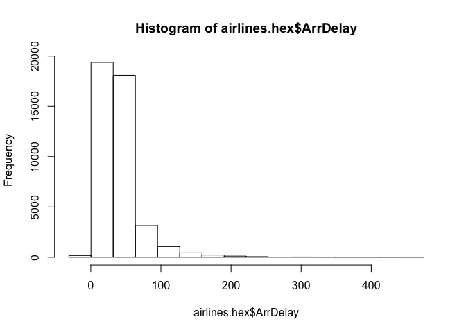

H20: Generalized Linear Models (GLM)
================
@jrcajide
8/4/2017

``` r
# install.packages("h2o")
library(h2o)
```

    ## 
    ## ----------------------------------------------------------------------
    ## 
    ## Your next step is to start H2O:
    ##     > h2o.init()
    ## 
    ## For H2O package documentation, ask for help:
    ##     > ??h2o
    ## 
    ## After starting H2O, you can use the Web UI at http://localhost:54321
    ## For more information visit http://docs.h2o.ai
    ## 
    ## ----------------------------------------------------------------------

    ## 
    ## Attaching package: 'h2o'

    ## The following objects are masked from 'package:stats':
    ## 
    ##     cor, sd, var

    ## The following objects are masked from 'package:base':
    ## 
    ##     &&, %*%, %in%, ||, apply, as.factor, as.numeric, colnames,
    ##     colnames<-, ifelse, is.character, is.factor, is.numeric, log,
    ##     log10, log1p, log2, round, signif, trunc

``` r
h2o.init(nthreads = 4, max_mem_size = "2G")
```

    ##  Connection successful!
    ## 
    ## R is connected to the H2O cluster: 
    ##     H2O cluster uptime:         8 minutes 41 seconds 
    ##     H2O cluster version:        3.10.3.6 
    ##     H2O cluster version age:    1 month and 19 days  
    ##     H2O cluster name:           H2O_started_from_R_JOSE_yps594 
    ##     H2O cluster total nodes:    1 
    ##     H2O cluster total memory:   1.61 GB 
    ##     H2O cluster total cores:    8 
    ##     H2O cluster allowed cores:  4 
    ##     H2O cluster healthy:        TRUE 
    ##     H2O Connection ip:          localhost 
    ##     H2O Connection port:        54321 
    ##     H2O Connection proxy:       NA 
    ##     R Version:                  R version 3.3.1 (2016-06-21)

``` r
# h2o.clusterInfo()
```

Generalized Linear Models (GLM): Provides flexible generalization of ordinary linear regression for response variables with error distribution models other than a Gaussian (normal) distribution. GLM unifies various other statistical models, including Poisson, linear, logistic, and others when using `1 and`2 regularization.

``` r
# Import dataset and display summary
airlinesURL = "https://s3.amazonaws.com/h2o-airlines-unpacked/allyears2k.csv"
airlines.hex = h2o.importFile(path = airlinesURL, destination_frame = "airlines.hex")
```

    ## 
      |                                                                       
      |                                                                 |   0%
      |                                                                       
      |=================================================================| 100%

``` r
summary(airlines.hex)
```

    ## Warning in summary.H2OFrame(airlines.hex): Approximated quantiles
    ## computed! If you are interested in exact quantiles, please pass the
    ## `exact_quantiles=TRUE` parameter.

    ##  Year           Month            DayofMonth     DayOfWeek      
    ##  Min.   :1987   Min.   : 1.000   Min.   : 1.0   Min.   :1.000  
    ##  1st Qu.:1992   1st Qu.: 1.000   1st Qu.: 6.0   1st Qu.:2.000  
    ##  Median :1998   Median : 1.000   Median :14.0   Median :4.000  
    ##  Mean   :1998   Mean   : 1.409   Mean   :14.6   Mean   :3.821  
    ##  3rd Qu.:2003   3rd Qu.: 1.000   3rd Qu.:23.0   3rd Qu.:5.000  
    ##  Max.   :2008   Max.   :10.000   Max.   :31.0   Max.   :7.000  
    ##                                                                
    ##  DepTime          CRSDepTime       ArrTime        CRSArrTime    
    ##  Min.   :   1.0   Min.   :   0.0   Min.   :   1   Min.   :   0  
    ##  1st Qu.: 927.4   1st Qu.: 908.6   1st Qu.:1117   1st Qu.:1107  
    ##  Median :1328.2   Median :1319.2   Median :1525   Median :1515  
    ##  Mean   :1345.8   Mean   :1313.2   Mean   :1505   Mean   :1485  
    ##  3rd Qu.:1733.8   3rd Qu.:1718.1   3rd Qu.:1916   3rd Qu.:1902  
    ##  Max.   :2400.0   Max.   :2359.0   Max.   :2400   Max.   :2359  
    ##  NA's   :1086                      NA's   :1195                 
    ##  UniqueCarrier FlightNum        TailNum                 ActualElapsedTime
    ##  US:18729      Min.   :   1.0   UNKNOW          :  179  Min.   : 16.0    
    ##  UA: 9434      1st Qu.: 202.4   000000          :  124  1st Qu.: 71.0    
    ##  WN: 6170      Median : 553.9   <0xE4>NKNO<0xE6>:  114  Median :101.0    
    ##  HP: 3451      Mean   : 818.8   0               :   66  Mean   :124.8    
    ##  PS: 3212      3rd Qu.:1241.0   N912UA          :   59  3rd Qu.:151.0    
    ##  DL:  935      Max.   :3949.0   N316AW          :   56  Max.   :475.0    
    ##                                 NA              :16024  NA's   :1195     
    ##  CRSElapsedTime AirTime         ArrDelay          DepDelay        
    ##  Min.   : 17    Min.   : 14.0   Min.   :-63.000   Min.   :-16.00  
    ##  1st Qu.: 71    1st Qu.: 61.0   1st Qu.: -6.000   1st Qu.: -2.00  
    ##  Median :102    Median : 91.0   Median :  2.000   Median :  1.00  
    ##  Mean   :125    Mean   :114.3   Mean   :  9.317   Mean   : 10.01  
    ##  3rd Qu.:151    3rd Qu.:140.0   3rd Qu.: 14.000   3rd Qu.: 10.00  
    ##  Max.   :437    Max.   :402.0   Max.   :475.000   Max.   :473.00  
    ##  NA's   :13     NA's   :16649   NA's   :1195      NA's   :1086    
    ##  Origin    Dest      Distance         TaxiIn            TaxiOut         
    ##  DEN:3558  PHX:9317  Min.   :  11.0   Min.   :  0.000   Min.   :  0.00  
    ##  PIT:3241  PHL:4482  1st Qu.: 323.0   1st Qu.:  3.000   1st Qu.:  9.00  
    ##  ORD:2246  PIT:3020  Median : 537.7   Median :  5.000   Median : 12.00  
    ##  BUR:2021  ORD:2103  Mean   : 730.2   Mean   :  5.381   Mean   : 14.17  
    ##  CLT:1781  CLT:1542  3rd Qu.: 916.9   3rd Qu.:  6.000   3rd Qu.: 16.00  
    ##  PHL:1632  DEN:1470  Max.   :3365.0   Max.   :128.000   Max.   :254.00  
    ##                      NA's   :35       NA's   :16026     NA's   :16024   
    ##  Cancelled         CancellationCode Diverted           CarrierDelay     
    ##  Min.   :0.00000   B :   93         Min.   :0.000000   Min.   :  0.000  
    ##  1st Qu.:0.00000   A :   81         1st Qu.:0.000000   1st Qu.:  0.000  
    ##  Median :0.00000   C :   47         Median :0.000000   Median :  0.000  
    ##  Mean   :0.02469   NA:43757         Mean   :0.002479   Mean   :  4.048  
    ##  3rd Qu.:0.00000                    3rd Qu.:0.000000   3rd Qu.:  0.000  
    ##  Max.   :1.00000                    Max.   :1.000000   Max.   :369.000  
    ##                                                        NA's   :35045    
    ##  WeatherDelay       NASDelay          SecurityDelay      LateAircraftDelay
    ##  Min.   :  0.0000   Min.   :  0.000   Min.   : 0.00000   Min.   :  0.00   
    ##  1st Qu.:  0.0000   1st Qu.:  0.000   1st Qu.: 0.00000   1st Qu.:  0.00   
    ##  Median :  0.0000   Median :  0.000   Median : 0.00000   Median :  0.00   
    ##  Mean   :  0.2894   Mean   :  4.855   Mean   : 0.01702   Mean   :  7.62   
    ##  3rd Qu.:  0.0000   3rd Qu.:  0.000   3rd Qu.: 0.00000   3rd Qu.:  0.00   
    ##  Max.   :201.0000   Max.   :323.000   Max.   :14.00000   Max.   :373.00   
    ##  NA's   :35045      NA's   :35045     NA's   :35045      NA's   :35045    
    ##  IsArrDelayed IsDepDelayed
    ##  YES:24441    YES:23091   
    ##  NO :19537    NO :20887   
    ##                           
    ##                           
    ##                           
    ##                           
    ## 

``` r
# View quantiles and histograms
#high_na_columns = h2o.ignoreColumns(data = airlines.hex)
quantile(x = airlines.hex$ArrDelay, na.rm = TRUE)
```

    ##    0.1%      1%     10%     25%   33.3%     50%   66.7%     75%     90% 
    ## -39.000 -26.000 -13.000  -6.000  -3.000   2.000   9.000  14.000  37.000 
    ##     99%   99.9% 
    ## 132.000 277.218

``` r
h2o.hist(airlines.hex$ArrDelay)
```



#### Find number of flights by airport

``` r
originFlights = h2o.group_by(data = airlines.hex, by = "Origin", nrow("Origin"), gb.control=list(na.methods="rm"))
originFlights.R = as.data.frame(originFlights)
knitr::kable(head(originFlights.R))
```

| Origin |  nrow\_Origin|
|:-------|-------------:|
| ABE    |            59|
| ABQ    |           876|
| ACY    |            31|
| ALB    |            75|
| AMA    |            11|
| ANC    |             1|

#### Find number of flights per month

``` r
flightsByMonth = h2o.group_by(data = airlines.hex, by = "Month", nrow("Month"),gb.control=list(na.methods="rm"))
flightsByMonth.R = as.data.frame(flightsByMonth)
knitr::kable(head(flightsByMonth.R))
```

|  Month|  nrow\_Month|
|------:|------------:|
|      1|        41979|
|     10|         1999|

#### Find months with the highest cancellation ratio

``` r
which(colnames(airlines.hex)=="Cancelled")
```

    ## [1] 22

``` r
cancellationsByMonth = h2o.group_by(data = airlines.hex, by = "Month", sum("Cancelled"),gb.control=list(na.methods="rm"))
cancellation_rate = cancellationsByMonth$sum_Cancelled/flightsByMonth$nrow
rates_table = h2o.cbind(flightsByMonth$Month, cancellation_rate)
rates_table.R = as.data.frame(rates_table)
knitr::kable(head(rates_table.R))
```

|  Month|  sum\_Cancelled|
|------:|---------------:|
|      1|       0.0254175|
|     10|       0.0095048|

#### Construct test and train sets using sampling

``` r
airlines.split = h2o.splitFrame(data = airlines.hex,ratios = 0.85)
airlines.train = airlines.split[[1]]
airlines.test = airlines.split[[2]]

head(airlines.train)
```

    ##   Year Month DayofMonth DayOfWeek DepTime CRSDepTime ArrTime CRSArrTime
    ## 1 1987    10         14         3     741        730     912        849
    ## 2 1987    10         15         4     729        730     903        849
    ## 3 1987    10         18         7     729        730     847        849
    ## 4 1987    10         19         1     749        730     922        849
    ## 5 1987    10         21         3     728        730     848        849
    ## 6 1987    10         22         4     728        730     852        849
    ##   UniqueCarrier FlightNum TailNum ActualElapsedTime CRSElapsedTime AirTime
    ## 1            PS      1451      NA                91             79     NaN
    ## 2            PS      1451      NA                94             79     NaN
    ## 3            PS      1451      NA                78             79     NaN
    ## 4            PS      1451      NA                93             79     NaN
    ## 5            PS      1451      NA                80             79     NaN
    ## 6            PS      1451      NA                84             79     NaN
    ##   ArrDelay DepDelay Origin Dest Distance TaxiIn TaxiOut Cancelled
    ## 1       23       11    SAN  SFO      447    NaN     NaN         0
    ## 2       14       -1    SAN  SFO      447    NaN     NaN         0
    ## 3       -2       -1    SAN  SFO      447    NaN     NaN         0
    ## 4       33       19    SAN  SFO      447    NaN     NaN         0
    ## 5       -1       -2    SAN  SFO      447    NaN     NaN         0
    ## 6        3       -2    SAN  SFO      447    NaN     NaN         0
    ##   CancellationCode Diverted CarrierDelay WeatherDelay NASDelay
    ## 1               NA        0          NaN          NaN      NaN
    ## 2               NA        0          NaN          NaN      NaN
    ## 3               NA        0          NaN          NaN      NaN
    ## 4               NA        0          NaN          NaN      NaN
    ## 5               NA        0          NaN          NaN      NaN
    ## 6               NA        0          NaN          NaN      NaN
    ##   SecurityDelay LateAircraftDelay IsArrDelayed IsDepDelayed
    ## 1           NaN               NaN          YES          YES
    ## 2           NaN               NaN          YES           NO
    ## 3           NaN               NaN           NO           NO
    ## 4           NaN               NaN          YES          YES
    ## 5           NaN               NaN           NO           NO
    ## 6           NaN               NaN          YES           NO

#### Display a summary using table-like functions

``` r
h2o.table(airlines.train$Cancelled)
```

    ##   Cancelled Count
    ## 1         0 36374
    ## 2         1   923
    ## 
    ## [2 rows x 2 columns]

``` r
h2o.table(airlines.test$Cancelled)
```

    ##   Cancelled Count
    ## 1         0  6518
    ## 2         1   163
    ## 
    ## [2 rows x 2 columns]

#### Set predictor and response variables

``` r
Y = "IsDepDelayed"
X = c("Origin", "Dest", "DayofMonth", "Year", "UniqueCarrier", "DayOfWeek", "Month", "DepTime", "ArrTime", "Distance")
```

#### Define the data for the model and display the results

``` r
airlines.glm <- h2o.glm(training_frame=airlines.train, x=X, y=Y, family = "binomial", alpha = 0.5)
```

    ## 
      |                                                                       
      |                                                                 |   0%
      |                                                                       
      |===                                                              |   4%
      |                                                                       
      |=================================================================| 100%

#### View model information: training statistics, performance, important variables

``` r
summary(airlines.glm)
```

    ## Model Details:
    ## ==============
    ## 
    ## H2OBinomialModel: glm
    ## Model Key:  GLM_model_R_1491766252139_9 
    ## GLM Model: summary
    ##     family  link                                regularization
    ## 1 binomial logit Elastic Net (alpha = 0.5, lambda = 1.528E-4 )
    ##   number_of_predictors_total number_of_active_predictors
    ## 1                        283                         173
    ##   number_of_iterations  training_frame
    ## 1                    5 RTMP_sid_aaf4_9
    ## 
    ## H2OBinomialMetrics: glm
    ## ** Reported on training data. **
    ## 
    ## MSE:  0.2139357
    ## RMSE:  0.4625318
    ## LogLoss:  0.6167004
    ## Mean Per-Class Error:  0.3868186
    ## AUC:  0.7182849
    ## Gini:  0.4365699
    ## R^2:  0.1418559
    ## Null Deviance:  51600.2
    ## Residual Deviance:  46002.15
    ## AIC:  46350.15
    ## 
    ## Confusion Matrix (vertical: actual; across: predicted) for F1-optimal threshold:
    ##          NO   YES    Error          Rate
    ## NO     5896 11766 0.666176  =11766/17662
    ## YES    2110 17525 0.107461   =2110/19635
    ## Totals 8006 29291 0.372041  =13876/37297
    ## 
    ## Maximum Metrics: Maximum metrics at their respective thresholds
    ##                         metric threshold    value idx
    ## 1                       max f1  0.378584 0.716388 303
    ## 2                       max f2  0.071329 0.847589 397
    ## 3                 max f0point5  0.542215 0.680323 206
    ## 4                 max accuracy  0.538281 0.659785 209
    ## 5                max precision  0.977203 1.000000   0
    ## 6                   max recall  0.049356 1.000000 399
    ## 7              max specificity  0.977203 1.000000   0
    ## 8             max absolute_mcc  0.539603 0.321631 208
    ## 9   max min_per_class_accuracy  0.528538 0.657627 216
    ## 10 max mean_per_class_accuracy  0.539603 0.660966 208
    ## 
    ## Gains/Lift Table: Extract with `h2o.gainsLift(<model>, <data>)` or `h2o.gainsLift(<model>, valid=<T/F>, xval=<T/F>)`
    ## 
    ## 
    ## 
    ## Scoring History: 
    ##             timestamp   duration iteration negative_log_likelihood
    ## 1 2017-04-09 21:39:55  0.000 sec         0             25800.10048
    ## 2 2017-04-09 21:39:55  0.020 sec         1             23119.13142
    ## 3 2017-04-09 21:39:55  0.031 sec         2             23051.52710
    ## 4 2017-04-09 21:39:55  0.041 sec         3             23042.83180
    ## 5 2017-04-09 21:39:55  0.064 sec         4             22999.99694
    ## 6 2017-04-09 21:39:55  0.073 sec         5             23001.07589
    ##   objective
    ## 1   0.69175
    ## 2   0.62462
    ## 3   0.62352
    ## 4   0.62349
    ## 5   0.62274
    ## 6   0.62275
    ## 
    ## Variable Importances: (Extract with `h2o.varimp`) 
    ## =================================================
    ## 
    ## Standardized Coefficient Magnitudes: standardized coefficient magnitudes
    ##              names coefficients sign
    ## 1       Origin.MDW     1.659022  POS
    ## 2       Origin.AUS     1.409374  NEG
    ## 3       Origin.HNL     1.366425  NEG
    ## 4       Origin.MYR     1.229544  NEG
    ## 5 UniqueCarrier.WN     1.068588  POS
    ## 
    ## ---
    ##                names coefficients sign
    ## 278       Origin.TUL     0.000000  POS
    ## 279       Origin.TYS     0.000000  POS
    ## 280       Origin.UCA     0.000000  POS
    ## 281 UniqueCarrier.AA     0.000000  POS
    ## 282 UniqueCarrier.CO     0.000000  POS
    ## 283 UniqueCarrier.US     0.000000  POS

#### Coefficients

``` r
h2o.coef(airlines.glm)
```

    ##        Intercept         Dest.ABE         Dest.ABQ         Dest.ACY 
    ##     1.291276e+02    -9.382540e-02     5.752754e-01     0.000000e+00 
    ##         Dest.ALB         Dest.AMA         Dest.ANC         Dest.ATL 
    ##     5.338895e-02     0.000000e+00     0.000000e+00    -2.439718e-01 
    ##         Dest.AUS         Dest.AVL         Dest.AVP         Dest.BDL 
    ##     0.000000e+00     0.000000e+00     0.000000e+00     2.503636e-01 
    ##         Dest.BGM         Dest.BHM         Dest.BNA         Dest.BOI 
    ##    -3.431609e-01     1.019893e-01     0.000000e+00     0.000000e+00 
    ##         Dest.BOS         Dest.BTV         Dest.BUF         Dest.BUR 
    ##     6.556714e-02    -5.110402e-01    -2.455291e-01    -2.270791e-01 
    ##         Dest.BWI         Dest.CAE         Dest.CAK         Dest.CHA 
    ##     3.458565e-01     4.093295e-01     0.000000e+00     0.000000e+00 
    ##         Dest.CHO         Dest.CHS         Dest.CLE         Dest.CLT 
    ##     2.552000e-01     1.854474e-01    -3.609488e-01    -3.069741e-01 
    ##         Dest.CMH         Dest.COS         Dest.CRP         Dest.CVG 
    ##     2.040259e-01    -5.197023e-01     0.000000e+00     0.000000e+00 
    ##         Dest.DAL         Dest.DAY         Dest.DCA         Dest.DEN 
    ##     1.403231e-01    -8.453218e-01     9.464038e-02    -1.426241e-01 
    ##         Dest.DFW         Dest.DSM         Dest.DTW         Dest.ELM 
    ##    -2.892888e-01     0.000000e+00     0.000000e+00     0.000000e+00 
    ##         Dest.ELP         Dest.ERI         Dest.EUG         Dest.EWR 
    ##     8.642836e-02     0.000000e+00     0.000000e+00     1.579295e-01 
    ##         Dest.EYW         Dest.FAT         Dest.FAY         Dest.FLL 
    ##     0.000000e+00     0.000000e+00    -2.388154e-01     5.893518e-01 
    ##         Dest.FNT         Dest.GEG         Dest.GRR         Dest.GSO 
    ##     0.000000e+00     1.775269e-01     0.000000e+00     1.269200e-01 
    ##         Dest.GSP         Dest.HNL         Dest.HOU         Dest.HPN 
    ##     0.000000e+00    -3.342381e-01     2.170903e-01     0.000000e+00 
    ##         Dest.HRL         Dest.HTS         Dest.IAD         Dest.IAH 
    ##     0.000000e+00     0.000000e+00    -3.131784e-01    -4.100514e-01 
    ##         Dest.ICT         Dest.ILM         Dest.IND         Dest.ISP 
    ##     0.000000e+00     0.000000e+00    -1.165186e-01    -2.970898e-01 
    ##         Dest.JAN         Dest.JAX         Dest.JFK         Dest.KOA 
    ##     0.000000e+00    -1.081263e-01     0.000000e+00     0.000000e+00 
    ##         Dest.LAS         Dest.LAX         Dest.LBB         Dest.LEX 
    ##     1.251589e-01     7.669495e-02     0.000000e+00     0.000000e+00 
    ##         Dest.LGA         Dest.LIH         Dest.LIT         Dest.LYH 
    ##     9.689315e-02     0.000000e+00     0.000000e+00     5.619095e-01 
    ##         Dest.MAF         Dest.MCI         Dest.MCO         Dest.MDT 
    ##     0.000000e+00    -1.453795e-02     4.693706e-01     0.000000e+00 
    ##         Dest.MDW         Dest.MHT         Dest.MIA         Dest.MKE 
    ##     3.163336e-01     0.000000e+00    -2.225602e-01    -3.556282e-01 
    ##         Dest.MRY         Dest.MSP         Dest.MSY         Dest.MYR 
    ##     0.000000e+00     0.000000e+00     0.000000e+00     0.000000e+00 
    ##         Dest.OAJ         Dest.OAK         Dest.OGG         Dest.OKC 
    ##     0.000000e+00     0.000000e+00     0.000000e+00     0.000000e+00 
    ##         Dest.OMA         Dest.ONT         Dest.ORD         Dest.ORF 
    ##    -2.886207e-01     1.276933e-01     3.187179e-02    -1.834142e-01 
    ##         Dest.ORH         Dest.PBI         Dest.PDX         Dest.PHF 
    ##     0.000000e+00     4.064049e-01     3.258652e-02     0.000000e+00 
    ##         Dest.PHL         Dest.PHX         Dest.PIT         Dest.PNS 
    ##     3.433170e-01     1.408293e-01     9.215209e-02    -4.313162e-01 
    ##         Dest.PSP         Dest.PVD         Dest.PWM         Dest.RDU 
    ##    -2.769708e-01    -8.119889e-02     0.000000e+00     3.354156e-01 
    ##         Dest.RIC         Dest.RNO         Dest.ROA         Dest.ROC 
    ##     0.000000e+00     3.486196e-02    -3.000000e-02     1.221780e-02 
    ##         Dest.RSW         Dest.SAN         Dest.SAT         Dest.SBN 
    ##     3.486031e-01    -1.140299e-01     0.000000e+00    -5.632684e-01 
    ##         Dest.SCK         Dest.SDF         Dest.SEA         Dest.SFO 
    ##     0.000000e+00     0.000000e+00     0.000000e+00     4.374192e-01 
    ##         Dest.SJC         Dest.SJU         Dest.SLC         Dest.SMF 
    ##     1.935174e-01     0.000000e+00     5.643646e-01     5.647974e-01 
    ##         Dest.SNA         Dest.SRQ         Dest.STL         Dest.STT 
    ##    -1.240716e-01     0.000000e+00     3.403814e-01     0.000000e+00 
    ##         Dest.SWF         Dest.SYR         Dest.TOL         Dest.TPA 
    ##     0.000000e+00     0.000000e+00     0.000000e+00     7.167424e-01 
    ##         Dest.TUL         Dest.TUS         Dest.UCA       Origin.ABE 
    ##    -1.447895e-01     2.042760e-01     0.000000e+00     0.000000e+00 
    ##       Origin.ABQ       Origin.ACY       Origin.ALB       Origin.AMA 
    ##    -7.314102e-01    -5.148680e-01     4.437672e-01     0.000000e+00 
    ##       Origin.ANC       Origin.ATL       Origin.AUS       Origin.AVP 
    ##     0.000000e+00     7.626115e-01    -1.409374e+00    -4.758378e-01 
    ##       Origin.BDL       Origin.BGM       Origin.BHM       Origin.BIL 
    ##     4.078809e-01     0.000000e+00    -6.550801e-01     0.000000e+00 
    ##       Origin.BNA       Origin.BOI       Origin.BOS       Origin.BTV 
    ##    -7.882028e-01    -6.592532e-01     2.065238e-01     7.626893e-02 
    ##       Origin.BUF       Origin.BUR       Origin.BWI       Origin.CAE 
    ##    -7.833307e-04    -9.183494e-01     0.000000e+00     0.000000e+00 
    ##       Origin.CHO       Origin.CHS       Origin.CLE       Origin.CLT 
    ##     5.411266e-02     1.227903e-02    -2.561503e-01     9.062975e-02 
    ##       Origin.CMH       Origin.COS       Origin.CRP       Origin.CRW 
    ##     3.732471e-01    -7.255725e-02     0.000000e+00    -6.216575e-01 
    ##       Origin.CVG       Origin.DAL       Origin.DAY       Origin.DCA 
    ##     0.000000e+00    -2.978608e-05     2.899066e-01     1.889962e-01 
    ##       Origin.DEN       Origin.DFW       Origin.DSM       Origin.DTW 
    ##     2.989747e-01     2.605340e-01     0.000000e+00     0.000000e+00 
    ##       Origin.EGE       Origin.ELP       Origin.ERI       Origin.EWR 
    ##     4.745739e-01     0.000000e+00     4.909474e-01    -1.367440e-01 
    ##       Origin.EYW       Origin.FLL       Origin.GEG       Origin.GNV 
    ##     0.000000e+00     2.516594e-01     0.000000e+00     0.000000e+00 
    ##       Origin.GRR       Origin.GSO       Origin.HNL       Origin.HOU 
    ##     0.000000e+00    -2.880636e-01    -1.366425e+00     0.000000e+00 
    ##       Origin.HPN       Origin.HRL       Origin.IAD       Origin.IAH 
    ##     1.062251e+00     0.000000e+00    -4.012148e-01    -8.625062e-01 
    ##       Origin.ICT       Origin.IND       Origin.ISP       Origin.JAN 
    ##     0.000000e+00     4.398666e-01     0.000000e+00     0.000000e+00 
    ##       Origin.JAX       Origin.JFK       Origin.KOA       Origin.LAN 
    ##     0.000000e+00    -4.493390e-01     0.000000e+00     0.000000e+00 
    ##       Origin.LAS       Origin.LAX       Origin.LBB       Origin.LEX 
    ##     8.226481e-02     5.715561e-01     0.000000e+00     6.616219e-01 
    ##       Origin.LGA       Origin.LIH       Origin.LIT       Origin.LYH 
    ##     5.732641e-01    -1.010628e+00     0.000000e+00     2.552000e-01 
    ##       Origin.MAF       Origin.MCI       Origin.MCO       Origin.MDT 
    ##     0.000000e+00     2.152820e-01     5.377119e-01     0.000000e+00 
    ##       Origin.MDW       Origin.MEM       Origin.MFR       Origin.MHT 
    ##     1.659022e+00    -2.165849e-01     0.000000e+00     3.920004e-02 
    ##       Origin.MIA       Origin.MKE       Origin.MLB       Origin.MRY 
    ##     6.621497e-01    -1.532114e-01     0.000000e+00    -5.270977e-01 
    ##       Origin.MSP       Origin.MSY       Origin.MYR       Origin.OAK 
    ##     0.000000e+00     0.000000e+00    -1.229544e+00    -3.091158e-01 
    ##       Origin.OGG       Origin.OKC       Origin.OMA       Origin.ONT 
    ##    -6.371593e-01    -2.116236e-01     5.358549e-01     2.294911e-01 
    ##       Origin.ORD       Origin.ORF       Origin.PBI       Origin.PDX 
    ##     6.306301e-01     1.641701e-01     6.630793e-01     3.239376e-01 
    ##       Origin.PHF       Origin.PHL       Origin.PHX       Origin.PIT 
    ##     0.000000e+00     3.148032e-01    -1.097209e-01     3.627546e-01 
    ##       Origin.PSP       Origin.PVD       Origin.PWM       Origin.RDU 
    ##     9.337114e-01     1.030321e-01    -5.140137e-01     0.000000e+00 
    ##       Origin.RIC       Origin.RNO       Origin.ROA       Origin.ROC 
    ##     0.000000e+00     5.583580e-01     0.000000e+00     3.337588e-01 
    ##       Origin.RSW       Origin.SAN       Origin.SAT       Origin.SAV 
    ##     0.000000e+00    -1.979581e-01     3.709758e-01    -4.314735e-01 
    ##       Origin.SBN       Origin.SCK       Origin.SDF       Origin.SEA 
    ##     0.000000e+00     0.000000e+00     0.000000e+00     1.589224e-02 
    ##       Origin.SFO       Origin.SJC       Origin.SJU       Origin.SLC 
    ##     1.908982e-01     0.000000e+00    -2.570480e-01    -5.871966e-01 
    ##       Origin.SMF       Origin.SNA       Origin.SRQ       Origin.STL 
    ##    -1.113944e-01    -1.852514e-01     4.499531e-01    -6.670350e-01 
    ##       Origin.STT       Origin.STX       Origin.SWF       Origin.SYR 
    ##     0.000000e+00     1.509223e-01     0.000000e+00     4.601462e-01 
    ##       Origin.TLH       Origin.TPA       Origin.TRI       Origin.TUL 
    ##    -7.251428e-01     1.483083e-01     0.000000e+00     0.000000e+00 
    ##       Origin.TUS       Origin.TYS       Origin.UCA UniqueCarrier.AA 
    ##    -2.410321e-01     0.000000e+00     0.000000e+00     0.000000e+00 
    ## UniqueCarrier.CO UniqueCarrier.DL UniqueCarrier.HP UniqueCarrier.PI 
    ##     0.000000e+00     2.918171e-01    -5.265586e-01    -4.488677e-02 
    ## UniqueCarrier.PS UniqueCarrier.TW UniqueCarrier.UA UniqueCarrier.US 
    ##    -3.472455e-01     6.608095e-01    -2.394169e-01     0.000000e+00 
    ## UniqueCarrier.WN             Year            Month       DayofMonth 
    ##     1.068588e+00    -6.512592e-02     4.200452e-02    -3.191920e-02 
    ##        DayOfWeek          DepTime          ArrTime         Distance 
    ##     3.032250e-02     7.788883e-04    -5.947842e-05     2.825392e-04

#### Variable Importances

``` r
h2o.varimp(airlines.glm)
```

    ## Standardized Coefficient Magnitudes: standardized coefficient magnitudes
    ##              names coefficients sign
    ## 1       Origin.MDW     1.659022  POS
    ## 2       Origin.AUS     1.409374  NEG
    ## 3       Origin.HNL     1.366425  NEG
    ## 4       Origin.MYR     1.229544  NEG
    ## 5 UniqueCarrier.WN     1.068588  POS
    ## 
    ## ---
    ##                names coefficients sign
    ## 278       Origin.TUL     0.000000  POS
    ## 279       Origin.TYS     0.000000  POS
    ## 280       Origin.UCA     0.000000  POS
    ## 281 UniqueCarrier.AA     0.000000  POS
    ## 282 UniqueCarrier.CO     0.000000  POS
    ## 283 UniqueCarrier.US     0.000000  POS

#### Predict using GLM model

``` r
pred = h2o.predict(object = airlines.glm, newdata = airlines.test)
```

    ## 
      |                                                                       
      |                                                                 |   0%
      |                                                                       
      |================================                                 |  50%
      |                                                                       
      |=================================================================| 100%

#### Look at summary of predictions: probability of TRUE class (p1)

``` r
summary(pred)
```

    ## Warning in summary.H2OFrame(pred): Approximated quantiles computed! If you
    ## are interested in exact quantiles, please pass the `exact_quantiles=TRUE`
    ## parameter.

    ##  predict   NO                YES              
    ##  YES:5263  Min.   :0.03084   Min.   :0.05083  
    ##  NO :1418  1st Qu.:0.34032   1st Qu.:0.40163  
    ##            Median :0.46797   Median :0.53111  
    ##            Mean   :0.47487   Mean   :0.52513  
    ##            3rd Qu.:0.59745   3rd Qu.:0.65876  
    ##            Max.   :0.94917   Max.   :0.96916
